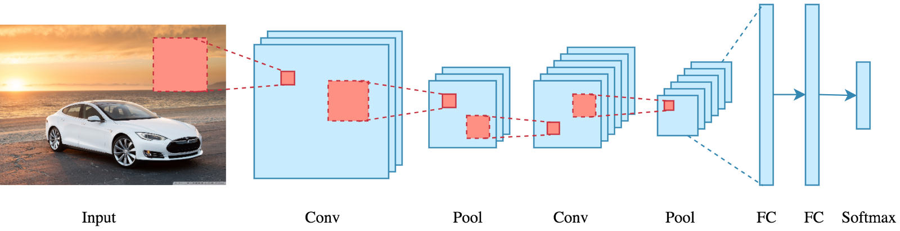
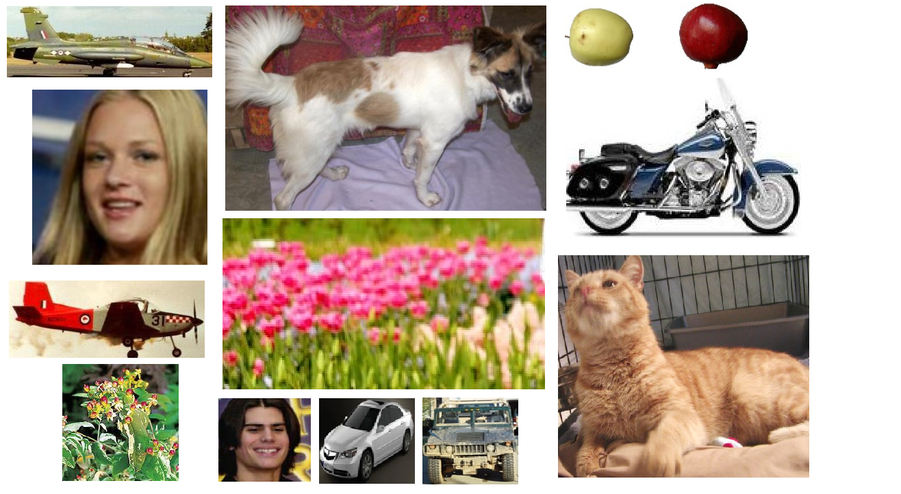

# Object Classification using Keras and TensorFlow

In this project, we classify objects from 8 classes and obtain a higher accuracy on a 
much smaller training time.

Read the Medium blog [here](https://medium.com/@equipintelligence/object-classification-from-scratch-using-tensorflow-and-keras-964e42e898b2).

We use [Deep Convolutional Neural Networks( DCNN )](https://medium.com/r/?url=https%3A%2F%2Fwww.youtube.com%2Fwatch%3Fv%3DFmpDIaiMIeA) 
for this classification task.

## The Dataset

The dataset is named [Natural Images](https://www.kaggle.com/prasunroy/natural-images) 
by [Prasun Roy](https://www.kaggle.com/prasunroy)
 on [Kaggle.com](https://www.kaggle.com).

## Regarding the Files

1. `models/` : Contains sample Keras model ( .h5 ).
2. `processed_data/` : Contains processed training and testing data in form of `.npy` files.
3. `random_images/` : Contains some random images.
4. `readme_images/` **( Not for use )** Only contains images which are embedded in the README.md file on this project.
5. `DataConverter.py` : Converts images to .npy files.
6. `Model.py` : Initializes the Keras Sequential Model.
7. `MainFile.py` : Bring all the components together for training the model.

## References

1. [How Convolutional Neural Networks work](https://www.youtube.com/watch?v=FmpDIaiMIeA)
by Brandon Rohrer.
2. CNN Image taken from [Applied Deep Learning - Part 4: Convolutional Neural Networks](https://towardsdatascience.com/applied-deep-learning-part-4-convolutional-neural-networks-584bc134c1e2)
